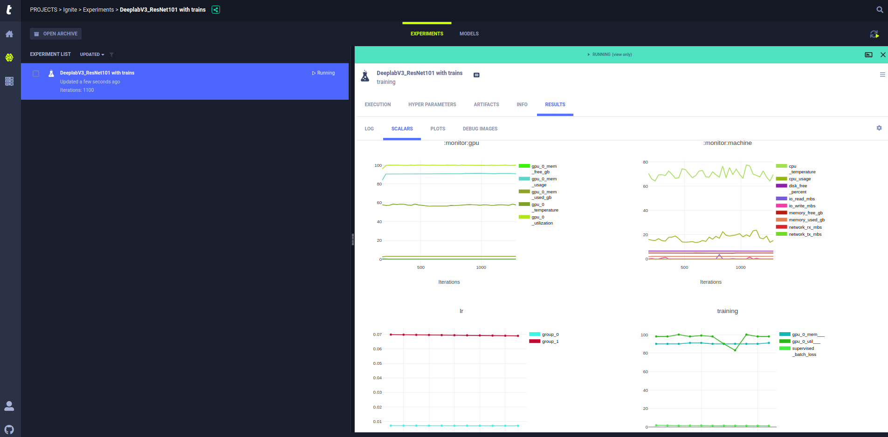

# Experiments tracking with Trains

**Allegro Trains** is a full system open source ML / DL experiment manager and ML-Ops solution. 
It is composed of a server, Python SDK and web UI. **Allegro Trains** enables data scientists and data engineers 
to effortlessly track, manage, compare and collaborate on their experiments as well as easily manage their 
training workloads on remote machines.



## Install trains

Install [trains](https://github.com/allegroai/trains) by executing the following command:

```bash
pip install trains
```

## Install The Segmentation Example Python Requirements 

```bash
pip install -r requirements.txt
```
  
## Download Pascal VOC2012 and SDB datasets

Download and extract the datasets:

```bash
python code/scripts/download_dataset.py /path/to/datasets
```

This script will download and extract the following datasets into `/path/to/datasets`

* The [Pascal VOC2012](http://host.robots.ox.ac.uk/pascal/VOC/voc2012/VOCtrainval_11-May-2012.tar) dataset
* Optionally, the [SBD](http://www.eecs.berkeley.edu/Research/Projects/CS/vision/grouping/semantic_contours/benchmark.tgz) evaluation dataset

## Setup the environment variables

### Setup the dataset path

Export the ``DATASET_PATH`` environment variable for the Pascal VOC2012 dataset.

```bash
export DATASET_PATH=/path/to/datasets
```
        
### Setup the SBD dataset path

Export the ``SBD_DATASET_PATH`` environment variable for the SBD evaluation dataset.

```bash
export SBD_DATASET_PATH=/path/to/datasets
```

## Run the experiment code

In **Trains**, when you run the experiment code, ``trains`` stores the experiment in [trains-server](https://github.com/allegroai/trains-server). 

By default, ``trains`` works with the demo **Trains Server** ([https://demoapp.trains.allegro.ai/dashboard](https://demoapp.trains.allegro.ai/dashboard)), 
which is open to anyone (although once a week it is refreshing and deleting all data). You can also set up your own self-hosted **Trains Server**. 

After the experiment code runs once, you can [reproduce the experiment](#reproducing-the-experiment) using the 
**Trains Web-App (UI)**, which is part of ``trains-server``. You only need to run the code once to store it 
in ``trains-server``.

### Run the code

Execute the following command: 

```bash
python -m py_config_runner ./code/scripts/trains_training.py ./configs/train/baseline_resnet101.py  --manual_config_load
```

In **Trains Web-App** a new project named *"ignite"* will be created, 
with an experiment named *"DeeplabV3_ResNet101 pascal_voc2012 segmentation example"* inside.

In your local environment, the console output includes the URL of the experiment's **RESULTS** page.

```console
TRAINS results page: https://demoapp.trains.allegro.ai/projects/21643e0f1c4a4c99953302fc88a1a84c/experiments/60763e04c0ba45ea9fe3cfe79f3f06a3/output/log
```
 
You can now view your experiment in **Trains** by clicking the link or copying the URL into your browser. 
It opens the results in the experiment's details pane, in the **Trains Web-App (UI)**.


#### Trains automatic Logging

When the experiment code runs, **Trains** automatically logs your environment, code, and the outputs.
Which means that you don't need to change your code.

All you need is 2 lines of integration (`import` and `Task.init`) at the top of your main script,
and the following will be logged by **Trains**:

* **Resource Monitoring** CPU/GPU utilization, temperature, IO, network, etc
* **Development Environment** Python environment, Git (repo, branch, commit) including uncommitted changes
* **Configuration** Including configuration files, command line arguments (ArgParser), and general dictionaries
* Full **stdout** and **stderr** automatic logging
* Model snapshots, with optional automatic upload to central storage.  
Storage options include shared folders, S3, GS, Azure, and http/s
* Artifacts log & store, including shared folders, S3, GS, Azure, and Http/s
* Matplotlib / Seaborn / TensorBoard / TensorBoardX scalars, metrics, histograms, images, audio, video, etc 

Additionally, **Trains** supports explicit logging by adding calls to the **Trains** Python client ``Logger`` 
class methods in the code. For more information, 
see [Explicit Reporting](https://allegro.ai/docs/examples/examples_explicit_reporting/) in the **Trains** documentation.    

## Track the experiment and visualize the results

In the **Trains Web-App (UI)**, track the experiment and visualize results in the experiment's details pane, 
which is organized in tabs and provides the following information;

* Source code, uncommitted changes, Python packages and versions, and other information, in the **EXECUTION** tab.
* Hyperparameters in the **HYPERPARAMETERS** tab.
* Input model, Configuration, Output model, and other artifacts in the **ARTIFACTS** tab.
* Experiment Comments and General experiment information in the **INFO** tab.
* Results in the **RESULTS** tab, including the log, scalar metric plots, plots of any data, and debug samples.

## Reproducing the experiments

In **Trains**, reproduce experiments using ``trains-agent`` for remote execution. Rerun the same experiment, 
by making an exact copy of it (a clone), and remotely execute the cloned experiment.

First, install ``trains-agent`` and then configure it to work with your self-hosted **Trains Server**. 

Once ``trains-agent`` is installed and configured, run ``trains-agent daemon``.
In **Trains**, we call these *workers*, they pop experiments from a queue and execute them. 
Every machine with a *trains-agent daemon*, becomes a registered *worker* in your **trains-server** cluster.

Using the **Trains Web-App**  you can easily send experiments to be remotely executed on one of these machines. 

More details can be found on the *trains-agent* [github](https://github.com/allegroai/trains-agent/)

### Install and configure trains-agent

1. Install ``trains-agent``.

        pip install trains-agent
        
1. Configure ``trains-agent`` by running the setup wizard.

        trains-agent init        

### Remotely execute the experiment

1. Start a **Trains** worker. Run a ``trains-agent daemon`` listening to a queue.

    For example, run a ``trains-agent daemon`` listening to the ``default`` queue and using multiple GPUs.

        trains-agent daemon --gpus 0,1 --queue default
        
1. Locate the experiment. In the **Trains Web-App (UI)**, Projects page, click on the project card.

1. If you want to run a copy of the experiment, and keep the original, do the following: 
    1. On the project page, right click the experiment.
    1. Click **Clone**.
    1. Select the project, type a name for the copy, and type a description, or accept the defaults.
    1. Click **CLONE**.

    The copy of the experiment is created. Its details pane opens.
    
1. Add the experiment (the original or the copy) to a queue that the ``trains-agent daemon`` is listening to.

    1. In the experiment table, right click the experiment.
    1. Click **Enqueue**.
    1. Select the default queue.
    1. Click **ENQUEUE**. 
    
    The experiment's status changes to Pending.

When the copy of the experiment reaches the top of the queue, the ``trains-agent deamon`` fetches it, 
its status changes to Running, and ``trains-agent`` executes it while logging and monitoring. 
You can track the experiment while it is in progress, and anytime afterwards.
